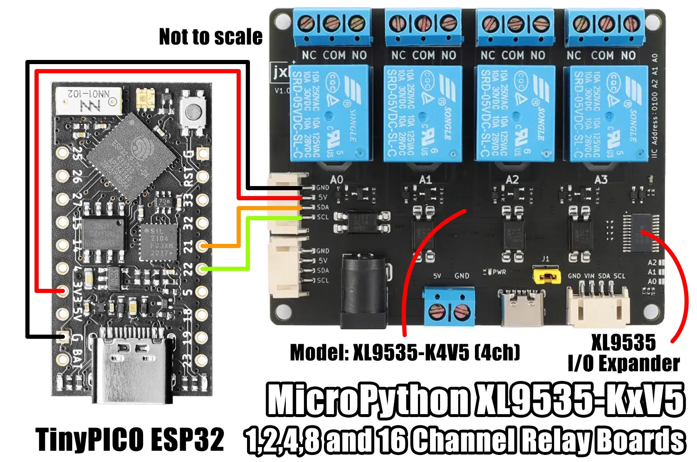
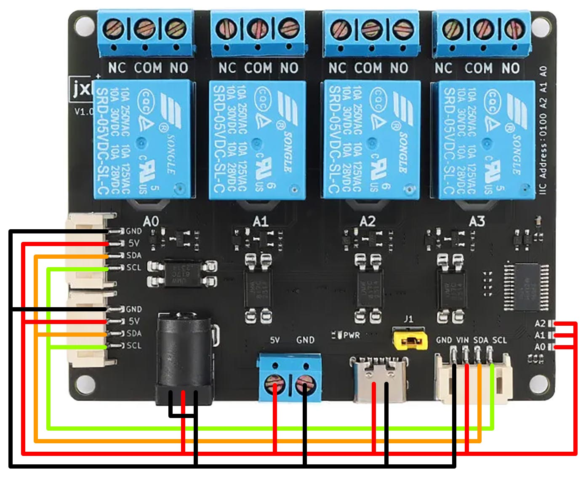
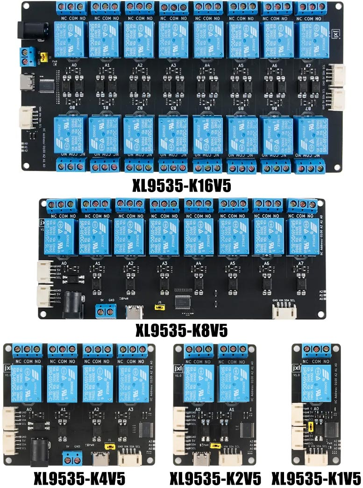
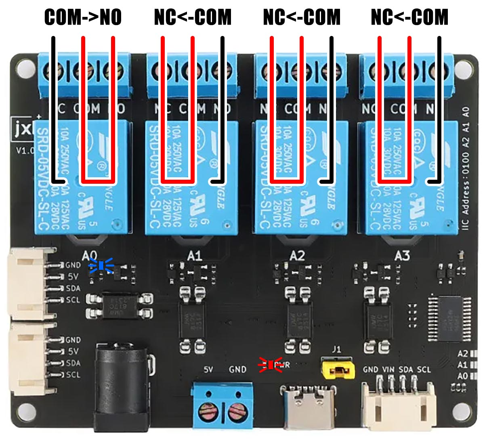

# MicroPython XL9535 KxV5 Relay

A MicroPython library for jxl XL9535-KxV5 I2C relay boards.

The board features a XL9535 16-bit I/O Expander with I2C Interface.




### Installation

Using mip via mpremote:

```bash
$ mpremote mip install github:mcauser/micropython-xl9535-kxv5-relay
$ mpremote mip install github:mcauser/micropython-xl9535-kxv5-relay/examples
```

Using mip directly on a WiFi capable board:

```python
>>> import mip
>>> mip.install("github:mcauser/micropython-xl9535-kxv5-relay")
>>> mip.install("github:mcauser/micropython-xl9535-kxv5-relay/examples")
```

Manual installation:

Copy `src/xl9535_relay.py` to the root directory of your device.


## Examples

**Basic usage**

```python
from machine import I2C, Pin
i2c = I2C(0)

i2c.scan()
# [32]

import xl9535_relay
board = xl9535_relay.XL9535_KXV5(i2c, 0x20)

# start with all circuits on, all relays off
board.init()

# switch relay A0 on
board.relay(0, True)

# switch relay A1 on
board.relay(1, True)

# switch relay A2 off
board.relay(3, False)

# switch relay A3 on
board.relay(3, True)

# is relay A0 on?
board.relay(0)
# True

# what relays are on?
board.relays()
# 11
# 11 == 0b_0000_0000_0000_1011 = 0x000B
# bit0 = relay A0 on
# bit1 = relay A1 on
# bit2 = relay A2 off
# bit3 = relay A3 on
# ...
# bit14 = relay B6 off
# bit15 = relay B7 off

# turn all relays on
board.relays(0xffff)

# turn all relays off
board.relays(0x0000)
```

For more detailed examples, see [examples](/examples).


## Board info

A continuity check confirms all (SCL/SDA/5V/GND) I2C ports share the same bus.
The JST PH2.0 4P connector is the same size as Seeed's Grove connector, but the pin order is different.
Supports 400kHz I2C frequency.

All of the power sockets are common, I2C, DC jack, USB-C.
Each support 2.3 - 5.5V.
The DC jack is NOT 12V compatible!

There is no logic-level conversion on the I2C pins.
The XL9535 is 5V tolerant and works fine on a 3.3V MCU.

Supplying power on any source lights the red PWR LED.
When a relay is triggered, it's corresponding blue LED is lit.



If the yellow jumper J1 is removed, all relays are switched off.

After reconnecting, you will need to reconfigure the outputs/config, ie. call `board.init()`

The board uses the XL9535 I/O expander as output only, and doesn't use interrupts.
Each IO pin is connected to a relay and it doesn't make sense configuring it as an input.


### Board variants

There are 5 variants of this board, featuring 1,2,4,8 or 16 relays.

* XL9535-K1V5
* XL9535-K2V5
* XL9535-K4V5
* XL9535-K8V5
* XL9535-K16V5




### Relays

The relays are Songle SRD-05VDC-SL-C with a 10A switching capacity.

If a relay's blue LED is on, COM is connected to NO and NC is not connected.

`NC-x-COM<->NO`

If a relay's blue LED is off, COM is connected to NC and NO is not connected.

`NC<-->COM-x-NO`




### I2C Interface

There are three address select pins (A0,A1,A2) providing addresses 0x20-0x27 for up to 8 of these devices on the I2C bus.

The board includes pull-up resistors on the SCL + SDA lines.

Add a dab of solder to bridge the address select pads to pull A0,A1,A2 up to VCC.

A0  | A1  | A2  | I2C Address
:---|:----|:----|:-----------
-   | -   | -   | 0x20 (default)
VCC | -   | -   | 0x21
-   | VCC | -   | 0x22
VCC | VCC | -   | 0x23
-   | -   | VCC | 0x24
VCC | -   | VCC | 0x25
-   | VCC | VCC | 0x26
VCC | VCC | VCC | 0x27


### Parts

* [XL9535-KxV5 boards](https://s.click.aliexpress.com/e/_DnDJHmd)
* [TinyPICO](https://www.tinypico.com/)


## Connections

### TinyPICO ESP32

```python
from machine import SoftI2C, Pin
i2c = SoftI2C(scl=Pin(22), sda=Pin(21))

from machine import I2C, Pin
i2c = I2C(0)
```

XL9535-KxV5  | TinyPICO (ESP32)
------------ | ----------------
GND          | GND
VCC          | 3V3
SDA          | 21 (SDA)
SCL          | 22 (SCL)


## Links

* [micropython.org](http://micropython.org)
* [XL9535 datasheet](docs/XL9535.pdf)
* [SRD-05VDC-SL-C datasheet](docs/SRD-05VDC-SL-C.pdf)
* [SRD-05VDC-SL-C (CN) datasheet](docs/SRD-05VDC-SL-C-cn.pdf)
* [TinyPICO Getting Started](https://www.tinypico.com/gettingstarted)


## License

Licensed under the [MIT License](http://opensource.org/licenses/MIT).

Copyright (c) 2024 Mike Causer
